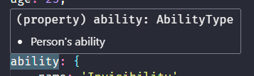
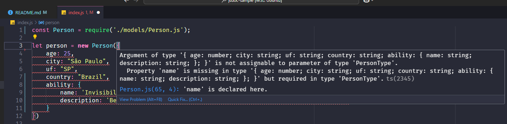
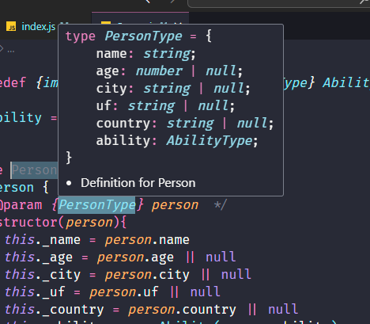
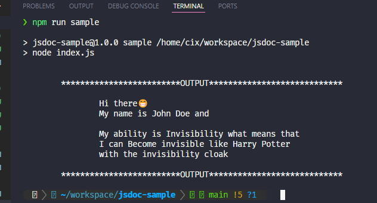

# JSDoc with classes sample

This project intends to show how JSDoc with classes can be an alternative to Typescript (no means that it is better, but, possible)

## Description

I've implemented two simple classes, Person and Ability, see that a person must have at least *name* and an *ability* with declared values, 
just a joke because all persons have abilities.

This project is built in using Vanilla Javascript, but typescript is installed to force variables to be declared according 
to its definitions, this is implemented by adding tsconfig.json file configuration.

Also, using some editor like vscode, you'll be able to see the types of variables while using this approach, and see errors if you do not declare variables according to expected by their definitions.

#### Short description to each parameter


#### Errors when types or parameters do not match


#### Shows expected params to the fields



## Getting Started

### Dependencies

* Node.js (Highly suggest to use nvm)


### Installing

* Clone this project
* If using nvm, run: ``` nvm install ```, if no, just skip
* Run ``` npm install ```
 

### Executing program

Run in the terminal the following command line
```
npm run sample
```

### SPOILERRRRRR 🍿


## Author

[@sra.cy_](https://www.instagram.com/sra.cy_/)